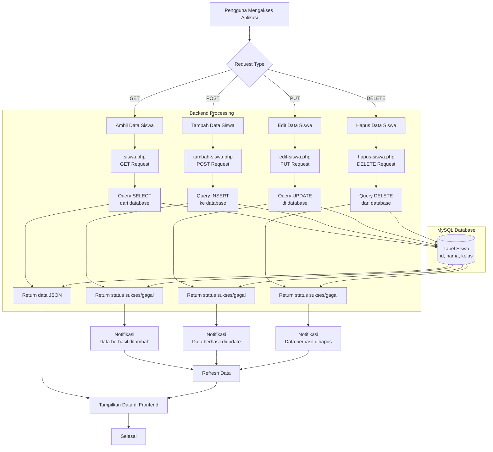

# 📂 Struktur Folder — Website Data Siswa

Proyek ini terbagi menjadi dua bagian utama: **Backend** (PHP + MySQL) dan **Frontend** (HTML/JS).
Berikut struktur folder lengkapnya:

```
website-data-siswa/
│
├── backend/                  # Folder untuk server-side (PHP + MySQL)
│   ├── koneksi.php           # File koneksi ke database MySQL
│   ├── siswa.php             # Endpoint untuk menampilkan (GET) data siswa
│   ├── tambah-siswa.php      # Endpoint untuk menambah (POST) data siswa
│   ├── edit-siswa.php        # Endpoint untuk mengedit (UPDATE) data siswa
│   ├── hapus-siswa.php       # Endpoint untuk menghapus (DELETE) data siswa
│
├── frontend/                 # Folder untuk client-side (HTML/JS)
│   └── index.html            # Halaman utama untuk menampilkan data siswa
│
└── readme.md                 # Dokumentasi proyek
```

---

## ✨ Penjelasan Singkat

* **Backend**
  Bagian ini berisi kode PHP yang berfungsi sebagai **REST API** untuk menangani operasi **CRUD** (Create, Read, Update, Delete) pada data siswa.

* **Frontend**
  Bagian ini menampilkan data siswa di browser. Frontend akan mengambil data dari **API (backend)** menggunakan JavaScript (misalnya `fetch()`).

* **Database**
  Proyek ini menggunakan **MySQL**. Pastikan database sudah dibuat dengan tabel `siswa` yang sesuai (id, nama, kelas).

---

## 🚀 Cara Menjalankan Proyek

1. Install **XAMPP / Laragon** dan jalankan `Apache` + `MySQL`.
2. Letakkan folder `website-data-siswa` di dalam `htdocs` (untuk XAMPP).
3. Import database:

   ```sql
   CREATE DATABASE db_siswa;
   USE db_siswa;
   CREATE TABLE siswa (
     id INT AUTO_INCREMENT PRIMARY KEY,
     nama VARCHAR(100),
     kelas VARCHAR(50)
   );
   ```
4. Akses API di browser:

   * `http://localhost/website-data-siswa/backend/siswa.php`
5. Akses halaman frontend:

   * `http://localhost/website-data-siswa/frontend/index.html`

---

# flowchart struktur


